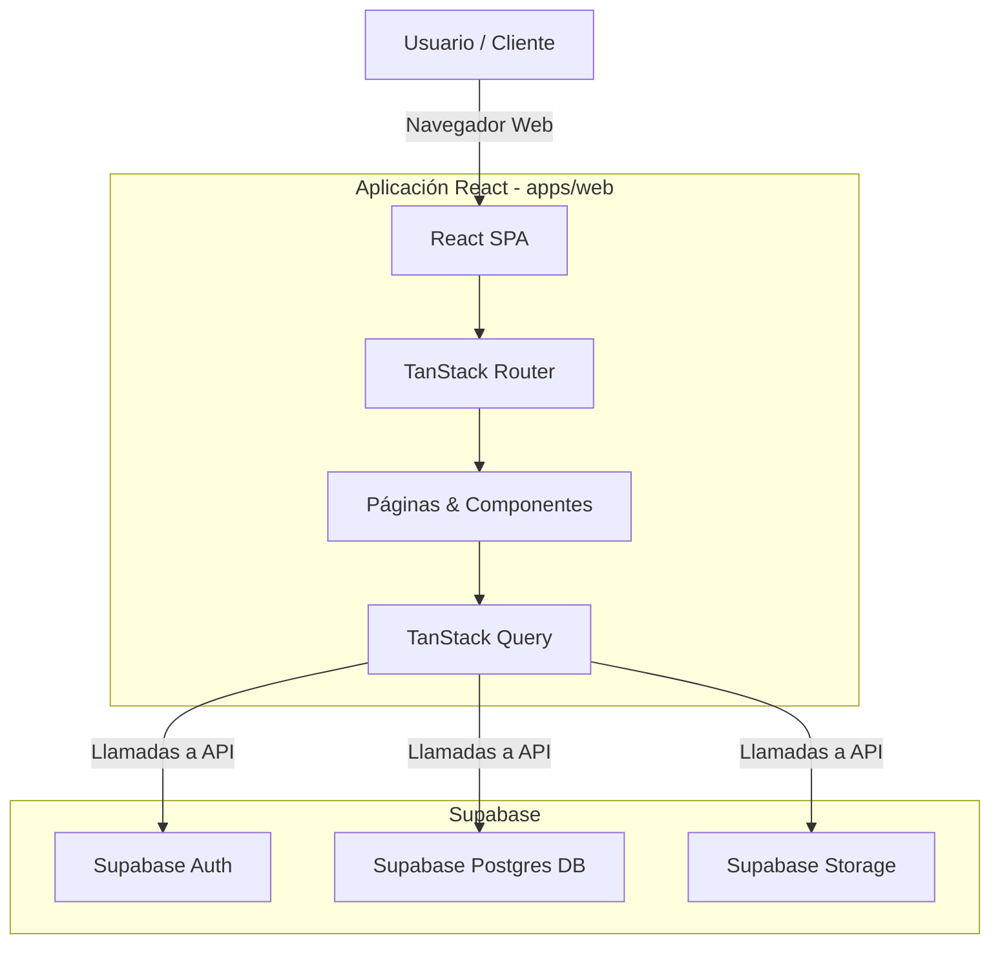
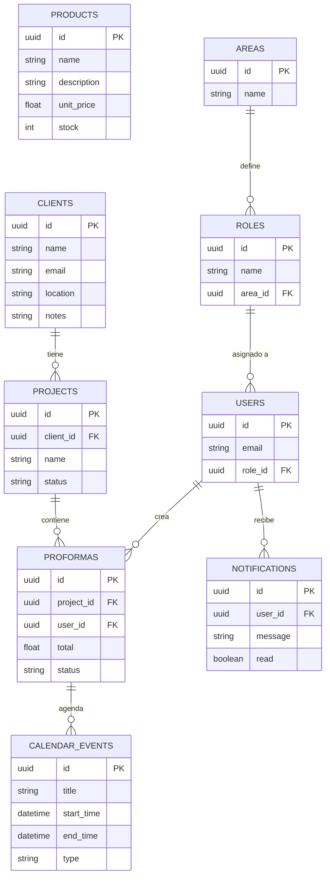

# Disagro ERP Workspace

Disagro ERP es una aplicación integral de gestión empresarial (ERP) construida bajo una arquitectura de monorepo utilizando **Bun**, **React**, **TypeScript** y **Vite**. La aplicación está diseñada para gestionar proformas, clientes, inventarios, agenda de eventos y roles de usuarios dentro de la organización. Utiliza **Supabase** como backend as a service (BaaS) para autenticación, base de datos (PostgreSQL) y almacenamiento.

## 🚀 Tecnologías Principales

- **Gestor de Paquetes y Runtime**: [Bun](https://bun.sh/)
- **Frontend (App Web)**: React 19, TypeScript, Vite
- **Estilos e Interfaces**: Tailwind CSS v4, Lucide React (Iconos)
- **Manejo de Estado y Datos**: TanStack Query v5 (React Query)
- **Enrutamiento**: TanStack Router
- **Backend & Base de Datos**: Supabase (PostgreSQL)
- **Validación de Código y Linter**: Biome, Oxlint

---

## 📂 Estructura del Monorepo

El proyecto está organizado como un workspace de Bun:

```text
disagro-erp-workspace/
├── apps/
│   └── web/            # Aplicación Frontend principal (React + Vite)
├── packages/           # Paquetes compartidos (si los hubiera)
├── package.json        # Configuración del workspace y scripts raíz
└── biome.json          # Configuración del linter/formatter
```

---

## 📊 Arquitectura del Sistema

El siguiente diagrama muestra la interacción de los componentes clave:



---

## 🗄️ Esquema de Base de Datos Principal

La base de datos relacional en Supabase está compuesta por las siguientes entidades principales (esquema simplificado):



## 🛠️ Comandos Disponibles

Ejecuta estos comandos desde la raíz del proyecto:

- `bun run dev`: Inicia el servidor de desarrollo local para todas las aplicaciones.
- `bun run build`: Compila la aplicación para producción.
- `bun run lint`: Ejecuta el linter (Biome) para revisar problemas de sintaxis y buenas prácticas.
- `bun run format`: Formatea el código automáticamente usando Biome.

## ⚙️ Configuración del Entorno

Asegúrate de configurar tus variables de entorno creando un archivo `.env` o `.env.local` dentro del directorio `apps/web`:

```env
VITE_SUPABASE_URL=tu_supabase_url
VITE_SUPABASE_ANON_KEY=tu_supabase_anon_key
```

## 📝 Scripts de Utilidad

La aplicación frontend cuenta con dependencias especializadas para:
- **Generación de PDFs**: `@react-pdf/renderer` para exportar las proformas.
- **Gráficos e Indicadores**: `recharts` para las vistas analíticas del dashboard.
- **Manejo de Fechas**: `date-fns` y `react-datepicker` para el calendario y programación.
- **Manejo de Excels**: `xlsx` para la carga masiva de inventarios.
