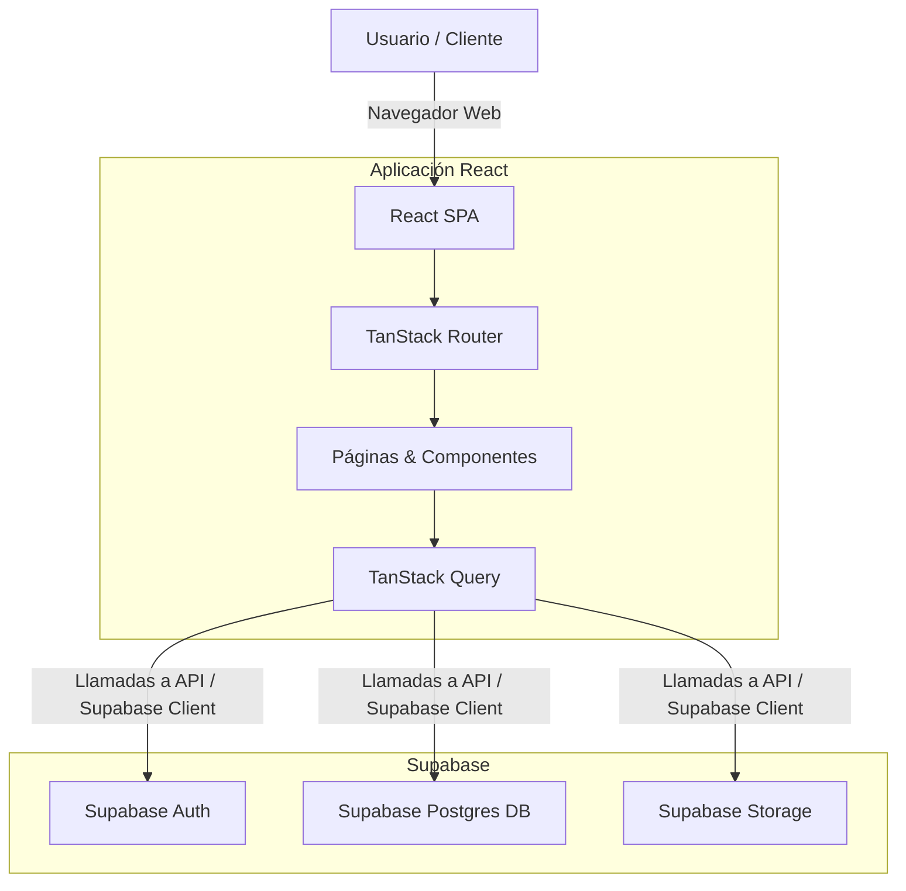
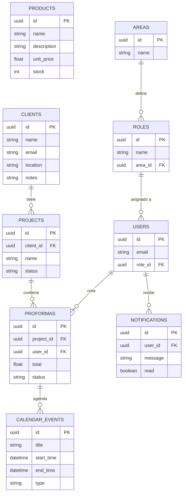

# Disagro ERP - Documentación del Proyecto

Disagro ERP es una aplicación de gestión empresarial (ERP) construida con **React, TypeScript y Vite**. Utiliza **Supabase** como backend como servicio (BaaS) para autenticación, base de datos y almacenamiento.

## 🚀 Tecnologías Principales

- **Frontend**: React, TypeScript, Vite
- **Estilos**: Tailwind CSS, Lucide React (Iconos)
- **Estado y Fetching**: TanStack Query (React Query)
- **Enrutamiento**: TanStack Router
- **Backend & BD**: Supabase (PostgreSQL)

---

## 📊 Diagrama de Arquitectura del Proyecto

El siguiente diagrama muestra cómo interactúan las piezas clave del sistema:



---

## 🗄️ Esquema de Base de Datos (Entity-Relationship)

La base de datos relacional en Supabase está compuesta por las siguientes entidades principales. (Esquema simplificado basado en el código del cliente):



## 🛠️ Comandos Disponibles

- `npm run dev` o `bun run dev`: Inicia el servidor de desarrollo en local.
- `npm run build` o `bun run build`: Compila la aplicación para producción.
- `npm run lint` o `bun run lint`: Ejecuta el linter (Biome) en el proyecto para revisar problemas de sintaxis.
- `npm run format` o `bun run format`: Formatea el código automáticamente usando Biome.

## ⚙️ Configuración del Entorno

Asegúrate de configurar tus variables de entorno en un archivo `.env` o `.env.local` en el directorio `apps/web`:

```env
VITE_SUPABASE_URL=tu_supabase_url
VITE_SUPABASE_ANON_KEY=tu_supabase_anon_key
```
